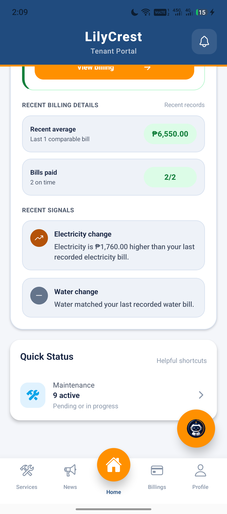
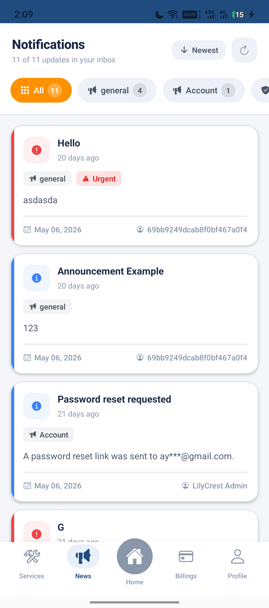
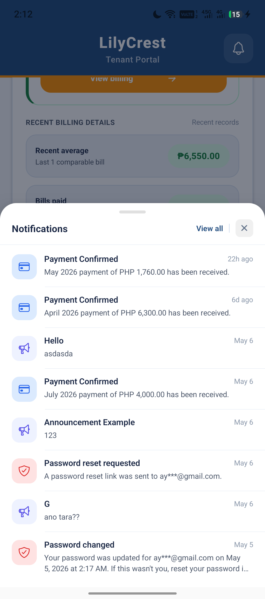
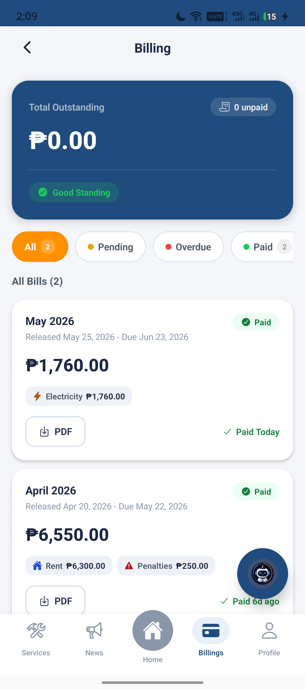
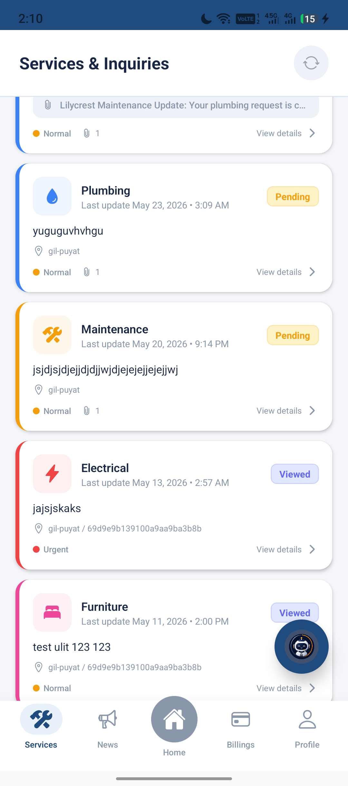
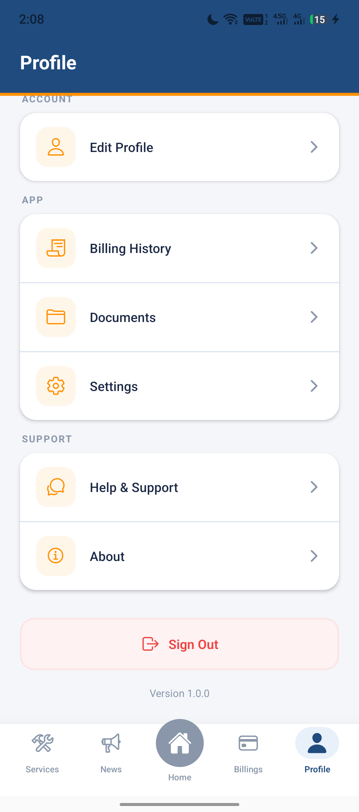
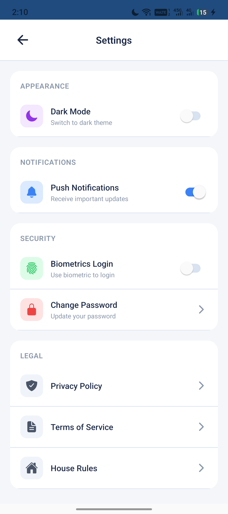

# LilyCrest Mobile App Manual

Last reviewed: 2026-05-27

## Scope

This manual documents the Expo React Native mobile app under `frontend/app` and `frontend/src`.

Production API domains:

- Mobile app API: `https://mobile-api.lilycrest.space`
- Mobile app API prefix: `https://mobile-api.lilycrest.space/api/m`
- Web/Admin API: `https://api.lilycrest.space`
- Direct mobile Render backend: `https://lilycrest-mobile.onrender.com`

The web/admin API domain must remain unchanged because it is used by the web/admin system. The mobile app should call the mobile API domain only at runtime.

Confirmed mobile API behavior:

- `GET https://mobile-api.lilycrest.space/api/m/health` should return `ok:true` and `service:"LilyCrest Mobile Backend"`.
- `GET https://mobile-api.lilycrest.space/api/m/notifications` may return `401 Unauthorized` without a token. That is acceptable and means the route exists.

Known Android/Expo issue under diagnosis:

- Expo logs show `API base URL: https://mobile-api.lilycrest.space`.
- Desktop PowerShell/browser can reach the mobile API.
- Android Expo app still reports Axios `Network Error` with no HTTP status for `/api/m/auth/me`, `/api/m/announcements`, `/api/m/notifications`, and `/api/m/dashboard/me`.
- This points to Android/device/app transport, DNS, TLS, stale bundle, or Axios adapter behavior rather than a wrong production URL.
- Dev-only startup diagnostics now compare native `fetch` and raw Axios health checks before protected calls are investigated.

## Screenshot Status

Actual PNG/JPEG screenshots are required for the final manual. Captured screenshots from the connected Android device are stored under `docs/mobile-screenshots/`; remaining states are tracked for safe follow-up capture.

- [Mobile Screenshot Index](./MOBILE_SCREENSHOT_INDEX.md)
- [Mobile Screenshot Capture TODO](./MOBILE_SCREENSHOT_CAPTURE_TODO.md)

Do not use generated mockups or fabricated screenshots. Use only actual device/emulator screenshots under `docs/mobile-screenshots/`.

## App Overview

LilyCrest Mobile is a tenant/resident mobile app. It provides:

- Tenant authentication with email/password, OTP, Google Sign-In, session restore, and optional biometric unlock.
- Resident dashboard with room/tenancy, billing, maintenance, notifications, and quick navigation.
- Announcements and notification-style updates.
- Billing history, paid payment history, bill details, PDF download, and PayMongo checkout.
- Maintenance/service requests with attachments and tenant/admin conversation updates.
- Profile editing, profile photo upload, settings, password changes, documents, and static policy pages.
- Push notification registration and token syncing.
- Lily Assistant chatbot and admin support chat.

## User Roles

The mobile app is primarily built for authenticated LilyCrest residents or tenants.

Supported app states:

- Logged-out visitor: can view onboarding, login, forgot password, reset password, OTP verification, and static legal/support pages when navigated directly.
- Authenticated tenant/resident: can use dashboard, announcements, services, billing, profile, settings, documents, assistant, and support chat.
- Admin or staff: no dedicated mobile admin UI was found. Some admin ticket methods exist in the shared API client, but no mobile route currently exposes an admin ticket management screen. Needs verification.

## Authentication Flow

Screenshot: Needs capture at `./mobile-screenshots/auth-login.png`.

### First Launch

1. The root layout mounts `AuthProvider`.
2. Notification handlers are initialized.
3. The app checks local storage for an existing `session_token`.
4. If no token exists, the auth state becomes unauthenticated.
5. If a token exists, the app calls `GET /api/m/auth/me`.
6. A valid user payload restores the session.
7. A `401` clears the stored session and keeps biometric settings available for future login.
8. Other failures can fall back to a cached `session_user` if one exists.

### Login Screen

The login screen supports:

- Email/password login.
- Remembered email.
- Forgot password navigation.
- Google Sign-In.
- Biometric unlock for an existing valid session.

Email validation:

- Email is required.
- Email must match normal email format.
- Email length is limited to 254 characters.

Password validation:

- Password is required.
- Whitespace is blocked.
- Login password must be at least 6 characters.
- Login password must be at most 128 characters.

Successful email/password login can return:

- A complete session payload, which stores `session_token` and `session_user`.
- An OTP requirement, which routes to `/otp-verify`.

### OTP Verification Flow

OTP login uses `/otp-verify`.

Expected behavior:

- The OTP code is 6 digits.
- The verification session is loaded from secure pending-login storage or route params.
- The user can resend the OTP after a cooldown.
- A valid OTP stores the session and routes to home.
- Invalid codes clear the entered digits and show an error.
- Missing or expired OTP state sends the user back to login.

### Google Sign-In Flow

Screenshot: Needs capture at `./mobile-screenshots/auth-google-signin.png`.

Native Android/iOS Google Sign-In uses `@react-native-google-signin/google-signin` when available in a dev client or production build. Web uses a Firebase popup only for testing/dev parity.

Native flow:

1. Configure Google Sign-In with `GOOGLE_WEB_CLIENT_ID`.
2. Check Google Play Services on Android.
3. Start native Google account selection.
4. Get Google token data.
5. Use Firebase credential sign-in.
6. Convert to a Firebase ID token.
7. Send the Firebase ID token to `POST /api/m/auth/google`.
8. Store backend `session_token` and user payload.

Failure behavior:

- Missing native module: prompts user to rebuild/install latest dev client.
- Missing Google web client ID: prompts reinstall/latest APK.
- Cancelled sign-in: does not create an error session.
- Backend `403`: account is not a verified/active tenant.
- Backend `401`: invalid auth token.

### Session Hydration Behavior

Screenshot: Needs capture at `./mobile-screenshots/session-hydration.png`.

Session hydration happens inside `AuthProvider` on startup.

Expected outcomes:

- No token: user is logged out.
- Valid token and valid `/auth/me` response: user is logged in.
- `401`: stored session is cleared.
- Network error or timeout: cached user may be used if valid.
- Invalid `/auth/me` shape: treated as a failed session check.

Current debugging note:

- The app has dev-only startup diagnostics in `frontend/src/utils/mobileDiagnostics.js` that compare native `fetch` and raw Axios against the mobile custom domain and direct Render health endpoint. The direct Render URL is diagnostic only, not an active runtime fallback.

## Home/Dashboard Flow

Route: `/(tabs)/home`

The Home screen loads:

- `GET /api/m/dashboard/me`
- `GET /api/m/notifications`, falling back to `GET /api/m/announcements` if notification fetch fails
- `GET /api/m/billing/history`

Main visible sections:

- App header and notification preview.
- Resident greeting and dashboard summary.
- Search shortcuts.
- Room or tenancy summary.
- Billing card and payment state.
- Maintenance/service summary.
- Recent updates.
- Assistant shortcut.

Tenancy/room data:

- The frontend expects dashboard data to include resident, room, branch, billing, maintenance, and tenancy-related fields.
- Contract end display depends on the shape returned by `/dashboard/me`. If the backend omits a contract end field, the UI cannot display it. Needs backend response verification.

Loading/error behavior:

- Initial load shows a skeleton/loading layout.
- Pull-to-refresh reloads dashboard data.
- Network and backend failures show a retryable dashboard error.
- Logged-out access shows a sign-in-required message.

## Announcements Flow

Confirmed behavior:

- `GET /api/m/announcements` returned HTTP 200 without a token during this pass, so announcements are currently public on the mobile API.

Route: `/(tabs)/announcements`

The Announcements screen calls:

- `GET /api/m/announcements`

Features:

- Pull-to-refresh.
- Manual refresh button.
- Polling through the tab badge logic every 60 seconds.
- Category/filter controls.
- Sort controls.
- Urgent-only filtering.
- Read-more modal for long announcements.
- Last-seen tracking through `lilycrest_announcements_last_seen`.

Expected logged-out behavior:

- Protected announcement routes may return `401`.
- The app should show a load error, not crash.

## Notifications Flow

Notifications are handled in two ways:

- Backend notification list: `GET /api/m/notifications`.
- Device push notifications through `expo-notifications`.

Notification behavior:

- Foreground push notifications show an in-app banner.
- Tapping a notification routes to a related screen when possible.
- Unread count is currently derived client-side by comparing notification/announcement `created_at` against `lilycrest_announcements_last_seen`.
- If no backend unread-count endpoint exists, the client-side fallback is expected.

Known acceptable API result:

- `GET /api/m/notifications` without auth may return `401 Unauthorized`.
- It must not return `404 Cannot GET /api/m/notifications` on the mobile domain.
- It must not fail as Axios `Network Error` when the Android device can reach the domain.

## Billing And Payment History Flow

Routes:

- `/(tabs)/billing`
- `/billing-history`
- `/bill-details`
- `/payment`
- `/payment-success`
- `/payment-cancel`

The billing history UI loads:

- `GET /api/m/billing/me/latest`
- `GET /api/m/billing/history`
- `GET /api/m/billing/history/paid`

Features:

- Latest bill summary.
- Billing history.
- Paid payment history.
- Status filters.
- Outstanding, overdue, and paid counts.
- Bill details navigation.
- Pay now actions.
- Official receipt/PDF download.
- PayMongo checkout.

Payment checkout:

1. User opens a bill.
2. App calls `GET /api/m/billing/:billingId`.
3. User starts payment.
4. App calls `POST /api/m/paymongo/checkout`.
5. App opens the checkout URL.
6. Success/cancel return URLs route to `/payment-success` or `/payment-cancel`.
7. Success screen can verify checkout status with `GET /api/m/paymongo/checkout/:checkoutId/status`.

Current history note:

- Payment history depends on `/billing/history/paid`. If this endpoint returns `404`, paid payments will be missing even if billing history works.

## Services And Maintenance Flow

Route: `/(tabs)/services`

The Services screen handles resident maintenance requests.

API calls:

- `GET /api/m/maintenance/me`
- `POST /api/m/maintenance`
- `GET /api/m/maintenance/:requestId`
- `PATCH /api/m/maintenance/:requestId/read`
- `PUT /api/m/maintenance/:requestId`
- `PATCH /api/m/maintenance/:requestId/cancel`
- `PATCH /api/m/maintenance/:requestId/reopen`
- `PATCH /api/m/maintenance/:requestId/confirm-resolved`
- `POST /api/m/maintenance/:requestId/replies`

Features:

- Active/resolved/cancelled request tabs.
- Search.
- Create maintenance request modal.
- Request type selection.
- Description input.
- Urgency.
- Attachments from camera, media library, or document picker.
- Detail modal with progress timeline and admin updates.
- Reply with text or attachments.
- Edit description for eligible requests.
- Cancel, reopen, or confirm resolved.

Validation:

- Request type is required.
- Description must be at least 10 characters.
- Attachments must be image/document types accepted by the upload helper.
- Image uploads are limited to 5 MB.
- Other attachment uploads are limited to 10 MB.
- Up to 4 maintenance attachments are allowed.

Needs verification:

- Exact backend accepted request types and urgency values should be verified against the mobile backend route validators.

## Profile And Account Flow

Route: `/(tabs)/profile`

The profile screen calls:

- `GET /api/m/users/me`
- `PUT /api/m/users/me`

Features:

- Profile view.
- Edit profile.
- Profile image update.
- Navigation to billing history, documents, settings, help/support, and about.
- Logout prompt.

Validation:

- Username has length and character restrictions.
- Email format is validated and whitespace is removed.
- Phone number is normalized and validated.
- Address has a max length.
- Profile image is converted to base64 and submitted through profile update.

Needs verification:

- Exact username, phone, and address limits should be checked against `frontend/app/(tabs)/profile.jsx` and backend validators before changing behavior.

## Documents Flow

Screenshot: Needs capture at `./mobile-screenshots/documents-list.png`.

Routes:

- `/documents`
- `/my-documents`

Document features:

- Download contract or generated document.
- View uploaded user documents.
- Upload resident documents.
- Delete uploaded document.
- Open/download a document file.

API calls:

- `GET /api/m/documents/:docId`
- `GET /api/m/users/documents`
- `POST /api/m/users/documents`
- `GET /api/m/users/documents/:docId`
- `DELETE /api/m/users/documents/:docId`

Auth:

- Document downloads attach the stored `session_token` as `Authorization: Bearer ...`.

Needs verification:

- Supported document types and required resident document categories should be verified against backend validators and admin requirements.

## Lily Assistant And Support Chat Flow

Screenshot: Needs capture at `./mobile-screenshots/lily-assistant.png`.

Route: `/(tabs)/chatbot`

The visible route renders `src/screens/LilyAssistantScreen.jsx`.

Features:

- AI assistant chat.
- Quick action prompts.
- Suggested follow-up chips.
- Attachment support in assistant mode.
- Admin support escalation.
- Support chat inquiries list.
- Support thread detail.
- Close/return to assistant behavior.

AI chatbot API calls:

- `POST /api/m/chatbot/message`
- `POST /api/m/chatbot/reset`

Support chat API calls:

- `POST /api/m/chat/start`
- `GET /api/m/chat/me`
- `GET /api/m/chat/:conversationId/messages`
- `POST /api/m/chat/:conversationId/messages`
- `PATCH /api/m/chat/:conversationId/close`

Validation:

- Chat input is sanitized.
- Chat messages are limited to 800 characters.
- Attachments are limited to 3 files.
- Attachments are limited to 10 MB.
- Duplicate attachments are blocked.
- Admin support messages are rate-limited client-side.

Needs verification:

- Backend support chat status values and full admin handoff rules should be verified against backend chat routes.

## Settings Flow

Route: `/settings`

Settings features:

- Push notification toggle.
- Biometric login toggle.
- Change password navigation.
- Privacy policy, terms, and house rules links.
- Dark mode state is provided through `ThemeContext`.

Notification toggle behavior:

- Enabling notifications requests permission and registers a token.
- Disabling notifications sends the stored token to the server with `notifications_enabled:false`.
- Push registration is skipped on web and if `expo-notifications` is unavailable.

Biometric behavior:

- The app checks hardware and enrollment.
- Enabling biometric login requires successful local authentication.
- Biometric login still depends on a valid stored app session.

## Password Management

Routes:

- `/forgot-password`
- `/reset-password`
- `/change-password`

Forgot password:

- Validates email.
- Calls `POST /api/m/auth/forgot-password`.
- Shows success state instructing the user to check email.

Reset password:

- Requires a reset token route param.
- New password must be strong.
- Confirm password must match.
- Calls `POST /api/m/auth/reset-password`.

Change password:

- Requires authenticated user.
- Current password is required.
- New password must be strong.
- Confirm password must match.
- Calls `POST /api/m/auth/change-password`.
- On success, the app logs out and sends the user to login.

Strong password rules:

- No whitespace.
- At least 8 characters.
- At least one uppercase letter.
- At least one lowercase letter.
- At least one number.
- At least one special character.

## Static And Informational Screens

Routes:

- `/about`
- `/privacy-policy`
- `/terms-of-service`
- `/house-rules`
- `/auth-callback`
- `/home`
- `/(tabs)/dashboard`

Notes:

- `/about` links to privacy policy and terms.
- `/house-rules` links to Lily Assistant.
- `/auth-callback` is a native Google Sign-In compatibility fallback and redirects to login.
- `/home` redirects to `/(tabs)/home`.
- `/(tabs)/dashboard` currently shows a simple redirecting text screen but does not actually redirect. Needs cleanup or implementation verification.

## Push Notification Registration Flow

OS-level push permission prompt screenshot still needs capture at `./mobile-screenshots/push-notification-permission.png`.

Push registration happens on first launch and after authentication.

Flow:

1. `AuthProvider` initializes notification handlers.
2. First launch may request permission.
3. Android notification channel is created.
4. App attempts to get Expo push token using the EAS project ID.
5. If Expo token is unavailable, Android falls back to a native device token.
6. Token is stored locally in `@lilycrest_push_token`.
7. When authenticated, token is synced to `POST /api/m/users/push-token`.
8. Token changes are subscribed and re-synced.
9. Logout attempts to mark the token as disabled.

Expected failures:

- No token: skip server sync.
- `401` while logging out can be suppressed.
- Notification module unavailable in Expo Go: skip push registration gracefully.

## Logout Flow

Screenshot: Needs capture at `./mobile-screenshots/logout.png`.

Logout behavior:

1. Read current session token and push token.
2. Clear secure credentials and app session locally.
3. Set auth state to unauthenticated.
4. Clear unread notification count.
5. Fire-and-forget backend logout.
6. Fire-and-forget push-token disable.
7. Sign out from Firebase.

The UI should return to the logged-out/auth flow immediately even if backend logout fails.

## Expected Behavior By API Status

### Logged Out

- Protected endpoints may return `401`.
- App should remain logged out or display login-required/retry messaging.
- Protected tab routes should not expose useful tenant data without a token.

### Logged In

- Protected endpoints should receive `Authorization: Bearer <session_token>`.
- `GET /auth/me` should return a valid user shape.
- Dashboard, billing, profile, services, announcements, notifications, and documents should load tenant-scoped data.

### 401 Unauthorized

- For auth/login endpoints: show credential, OTP, or access error.
- For protected session endpoints: clear invalid session when appropriate.
- For notification health checks: acceptable when no token is supplied.

### 404 Not Found

- Means either the endpoint is missing on the backend, the request hit the wrong backend, or the deployed route path is different.
- `Cannot GET /api/m/notifications` means the route is not mounted on the target backend.
- A 404 is different from Android Axios `Network Error` because a 404 has an HTTP response.

### 500 Internal Server Error

- Means backend code threw or returned an internal error.
- The app generally shows `getApiErrorMessage()` fallback text.
- Check Render logs using the response request ID when available.

### Axios Network Error

- Means Axios did not receive an HTTP response.
- Common causes: DNS failure, TLS/certificate issue, blocked domain, stale Android bundle, VPN/private DNS, device network restriction, adapter failure, timeout, or CORS-like behavior on web.
- On native Android, CORS should not normally block requests.
- Compare native `fetch` versus raw Axios using the startup smoke test.

## Known Issues And Troubleshooting Summary

Known current production issue:

- Android Expo receives Axios `Network Error` even though desktop curl reaches the mobile API.

Immediate troubleshooting priorities:

1. Confirm phone browser can open `https://mobile-api.lilycrest.space/api/m/health`.
2. Review startup smoke test logs for both native `fetch` and raw Axios.
3. Test the direct Render URL from the app smoke test.
4. Clear Metro cache with `npx expo start -c`.
5. Uninstall/reinstall the Android app or rebuild the dev client if a stale bundle is suspected.
6. Check Android VPN/private DNS/ad blocker settings.
7. Check Render request logs for whether Android requests arrive.
8. If direct Render works but custom domain fails on Android, investigate custom-domain DNS/TLS propagation or device DNS cache.
