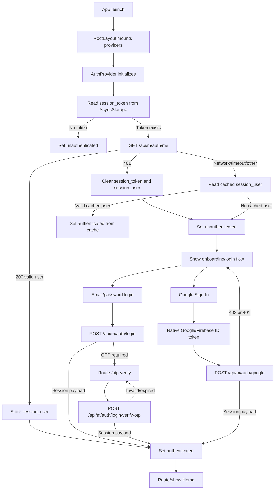
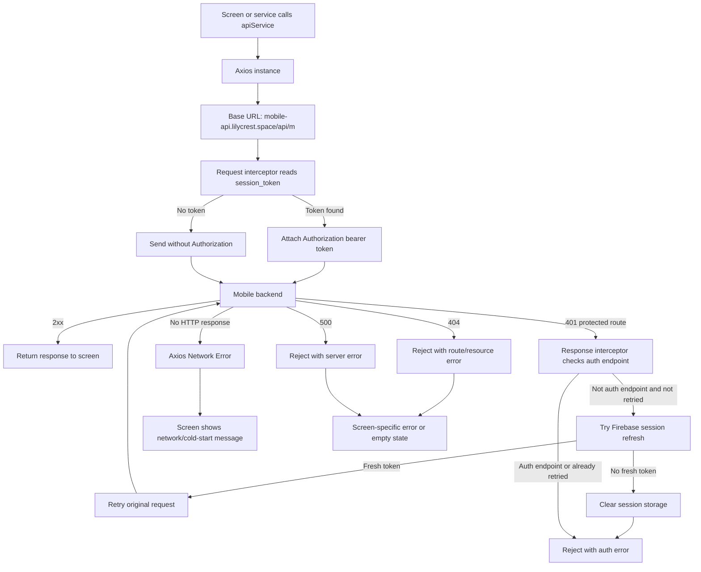
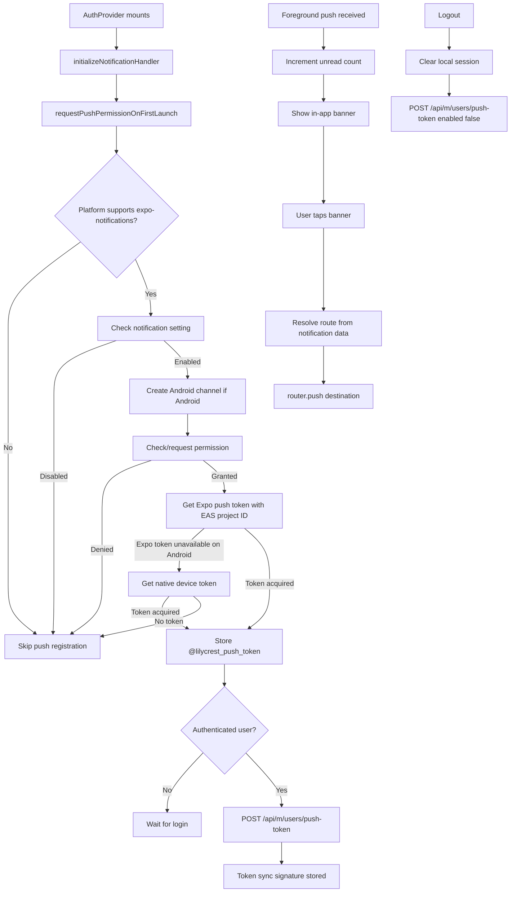
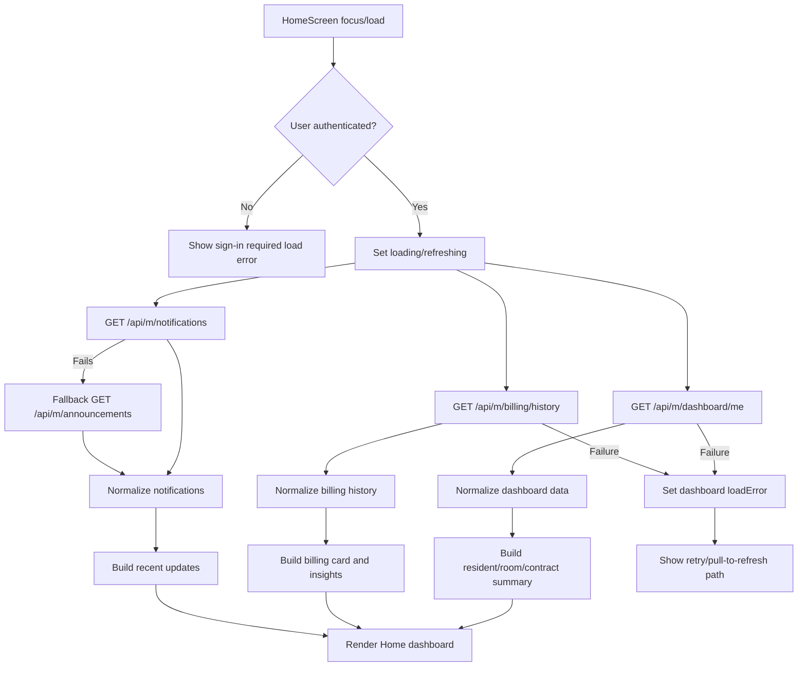
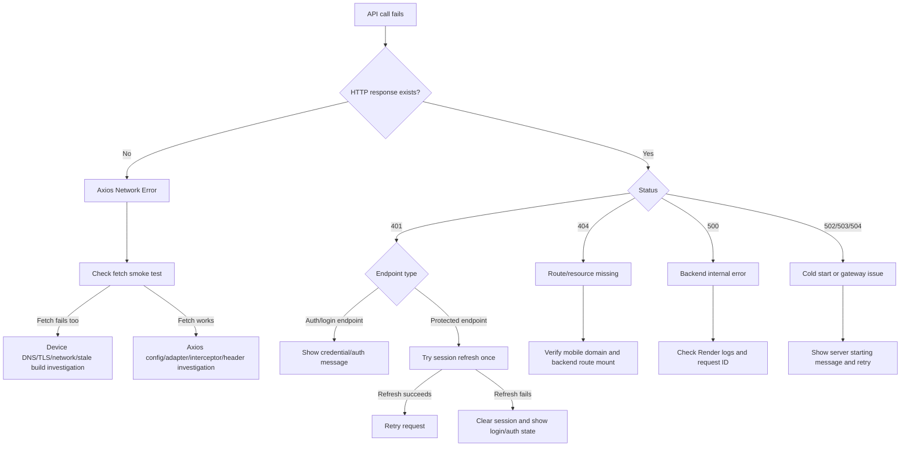
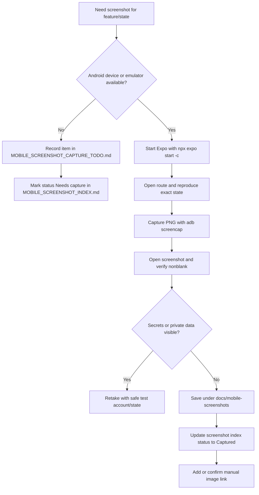

# LilyCrest Mobile Flow Diagrams

Last reviewed: 2026-05-27

Mobile API base:

- `https://mobile-api.lilycrest.space/api/m`

## Login, Auth, And Session Hydration



## Mobile API Request Flow



## Notifications And Push Token Flow



## Dashboard Data Loading Flow



## Billing And Payment Flow

```mermaid
flowchart TD
  A[Open Billing tab] --> B[GET /api/m/billing/me/latest]
  A --> C[GET /api/m/billing/history]
  A --> D[GET /api/m/billing/history/paid]
  B --> E[Render latest bill summary]
  C --> F[Render bill list]
  D --> G[Render payment history]
  F --> H[User opens bill details]
  H --> I[GET /api/m/billing/:billingId]
  I --> J[Render bill details]
  J --> K[User taps Pay Now]
  K --> L[POST /api/m/paymongo/checkout]
  L --> M[Open checkout URL]
  M -->|Success return| N[/payment-success]
  M -->|Cancel return| O[/payment-cancel]
  N --> P[GET /api/m/paymongo/checkout/:checkoutId/status]
  P --> Q[Emit billing refresh]
  Q --> A
```

## Error Handling Flow



## Screenshot Capture And Manual Update Flow


